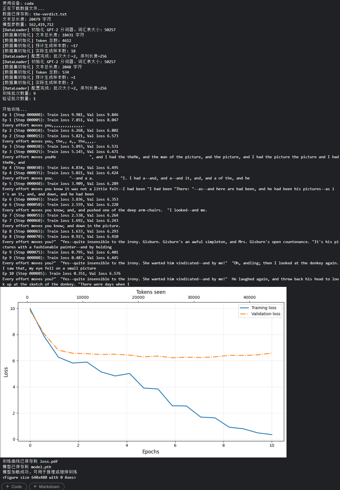
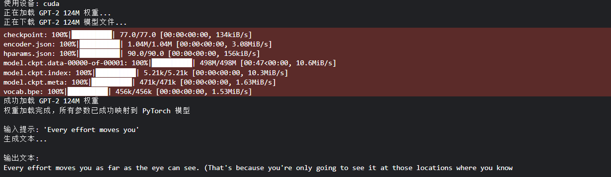
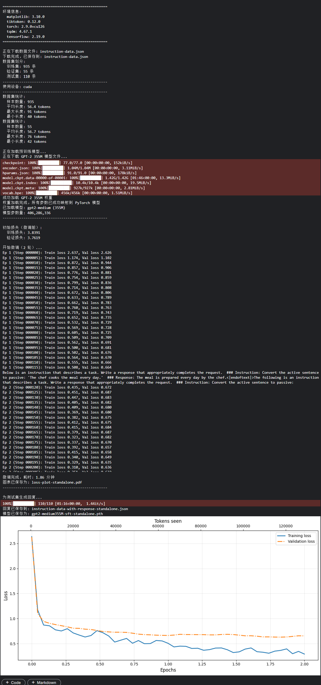

# GPT 语言模型实现与微调项目

[](https://www.python.org/downloads/)
[](https://pytorch.org/)
[](https://opensource.org/licenses/MIT)

本项目从零开始实现了完整的 GPT（Generative Pre-trained Transformer）语言模型架构，包含预训练、权重加载、指令微调（Instruction Fine-tuning）等完整流程。代码结构清晰、注释详尽，适合用于学习 Transformer 架构原理或作为 NLP 项目的基础框架。

## 📋 目录

- [项目特点](#-项目特点)
- [快速开始](#-快速开始)
- [项目结构](#-项目结构)
- [详细说明](#-详细说明)
  - [1. 数据预处理](#1-数据预处理)
  - [2. 模型架构](#2-模型架构)
  - [3. 训练流程](#3-训练流程)
  - [4. 预训练权重加载](#4-预训练权重加载)
  - [5. 指令微调](#5-指令微调)
- [配置说明](#-配置说明)
- [性能优化建议](#-性能优化建议)
- [参考资料](#-参考资料)
- [许可证](#-许可证)

## ✨ 项目特点

- **完整实现**: 从零实现 GPT 架构，包括多头注意力、层归一化、前馈网络、Transformer 块等所有核心组件
- **生产就绪**: 支持从 OpenAI 官方加载 GPT-2 预训练权重（124M/355M/774M/1558M）
- **指令微调**: 完整的指令微调（Instruction Fine-tuning）实现，支持 Alpaca 格式数据
- **灵活配置**: 通过配置文件轻松调整模型大小和训练参数
- **详尽注释**: 每行关键代码均配有详细中文注释，便于学习和理解

## 🚀 快速开始

### 环境要求

```bash
Python >= 3.8
PyTorch >= 2.0
CUDA >= 11.0 (推荐，用于GPU加速)
```

### 安装依赖

```bash
pip install torch torchvision torchaudio --index-url https://download.pytorch.org/whl/cu118
pip install tiktoken matplotlib tqdm tensorflow  # 用于加载TF检查点
```

### 1. 从头训练小型 GPT

```bash
python module_train.py
```

这将下载示例文本（《The Verdict》短篇小说），训练一个 124M 参数的小型 GPT 模型。

📋运行效果：

### 2. 加载预训练 GPT-2 生成文本

```bash
python module_load_param.py
```

自动下载 OpenAI GPT-2 权重并生成文本。支持选择不同大小的模型：
- `124M`: 小型（默认，适合普通GPU）
- `355M`: 中型（需要 8GB+ VRAM）
- `774M`: 大型（需要 16GB+ VRAM）
- `1558M`: XL（需要 24GB+ VRAM）

📋运行效果：

### 3. 指令微调

```bash
# 完整微调（使用 GPT-2 Medium，约需 30 分钟）
python module_fine_tuning.py

# 测试模式（使用极小模型，快速验证代码）
python module_fine_tuning.py --test_mode
```

📋运行效果：

## 📁 项目结构

```
modules/
├── data_preprocess.py              # 数据预处理：分词、数据集构建
├── generate_text_simple.py         # 基础文本生成（贪婪解码）
├── language_module.py              # GPT 模型架构定义
├── module_train.py                 # 训练流程与评估
├── module_load_param.py            # 预训练权重加载与增强生成
├── module_fine_tuning.py           # 指令微调实现
├── README.md                       # 本文件
└── requirements.txt                # 依赖列表
```

## 🔍 详细说明

### 1. 数据预处理

**文件**: `data_preprocess.py`

**核心功能**:
- 使用 `tiktoken`（GPT-2 官方分词器）进行 BPE 编码
- 滑动窗口切分长文本为固定长度序列
- 构建 `Input-Target` 对用于自回归训练

**关键参数**:
```python
max_length = 256    # 序列长度（上下文窗口）
stride = 128        # 滑动步长（控制数据重叠度）
batch_size = 8      # 批次大小
```

**使用示例**:
```python
from data_preprocess import create_dataloader_v1

with open("data.txt", "r") as f:
    text = f.read()

dataloader = create_dataloader_v1(
    text, 
    batch_size=4, 
    max_length=256, 
    stride=128
)
```

### 2. 模型架构

**文件**: `language_module.py`

实现了完整的 GPT 架构，包含以下组件：

| 组件 | 类名 | 说明 |
|------|------|------|
| 多头注意力 | `MultiHeadAttention` | 因果自注意力，支持多头的并行计算 |
| 层归一化 | `LayerNorm` | Pre-LN 结构，稳定深层网络训练 |
| 激活函数 | `GELU` | 高斯误差线性单元，平滑非线性 |
| 前馈网络 | `FeedForward` | 扩展-收缩结构（4x 维度） |
| Transformer块 | `TransformerBlock` | 注意力 + FFN + 残差连接 |
| GPT模型 | `GPTModel` | 完整模型，包含嵌入、Transformer堆叠、输出头 |

**配置示例**（GPT-2 Small）:
```python
GPT_CONFIG_124M = {
    "vocab_size": 50257,      # 词汇表大小
    "context_length": 1024,   # 最大序列长度
    "emb_dim": 768,           # 嵌入维度
    "n_heads": 12,            # 注意力头数
    "n_layers": 12,           # Transformer层数
    "drop_rate": 0.1,         # Dropout概率
    "qkv_bias": False         # QKV偏置
}
```

### 3. 训练流程

**文件**: `module_train.py`

**特性**:
- **自动设备检测**: 自动使用 CUDA GPU（如果可用）
- **定期评估**: 每 N 步计算验证损失，监控过拟合
- **文本生成示例**: 每个 epoch 结束生成文本，直观观察训练效果
- **训练可视化**: 自动生成损失曲线图（支持双坐标轴：epochs 和 tokens）

**训练循环核心逻辑**:
```python
for epoch in range(num_epochs):
    for batch in train_loader:
        optimizer.zero_grad()           # 1. 梯度清零
        loss = calc_loss_batch(...)     # 2. 前向传播
        loss.backward()                 # 3. 反向传播
        optimizer.step()                # 4. 参数更新
        
        if step % eval_freq == 0:
            evaluate_model(...)         # 定期评估
```

### 4. 预训练权重加载

**文件**: `module_load_param.py`

**功能**:
- 自动从 OpenAI 官方仓库下载 GPT-2 权重（TensorFlow 检查点格式）
- 跨框架权重转换（TensorFlow → PyTorch）
- 精确的权重映射（处理 QKV 分割、维度转置等差异）
- 增强版生成函数（支持 Temperature 采样和 Top-k 筛选）

**生成参数说明**:
```python
generate(
    model=model,
    idx=input_ids,
    max_new_tokens=100,
    temperature=0.8,    # <1.0 保守，>1.0 创造性
    top_k=40,           # 仅从概率前40的token采样
    eos_id=50256        # 遇到结束符停止
)
```

### 5. 指令微调

**文件**: `module_fine_tuning.py`

**数据格式**（Alpaca 风格）:
```json
{
    "instruction": "将以下英文翻译成中文",
    "input": "Hello, how are you?",
    "output": "你好，你好吗？"
}
```

**关键技术**:
- **自定义 Collate Function**: 处理变长序列，屏蔽填充 token 的损失
- **损失屏蔽**: 只在 `### Response:` 部分计算损失，避免学习输入模板
- **权重冻结选项**: 可选择性冻结底层参数，只微调顶层（代码中可扩展）

**微调策略**:
- 使用较小的学习率（5e-5，比预训练小 10-100 倍）
- 较少的训练轮次（通常 2-3 轮即可）
- 保留第一个填充 token 的损失，让模型学习何时停止生成

## ⚙️ 配置说明

### 模型大小对比

| 模型 | 参数量 | 嵌入维度 | 层数 | 头数 | 显存需求 |
|------|--------|----------|------|------|----------|
| Small (124M) | 124M | 768 | 12 | 12 | ~2GB |
| Medium (355M) | 355M | 1024 | 24 | 16 | ~6GB |
| Large (774M) | 774M | 1280 | 36 | 20 | ~12GB |
| XL (1558M) | 1.5B | 1600 | 48 | 25 | ~24GB |

### 关键超参数调优建议

| 参数 | 预训练建议 | 微调建议 | 说明 |
|------|-----------|---------|------|
| learning_rate | 1e-4 ~ 1e-3 | 1e-5 ~ 1e-4 | 微调时使用更小学习率 |
| batch_size | 根据显存最大化 | 4-16 | 越大越稳定，但需更多显存 |
| num_epochs | 10-100+ | 2-5 | 微调容易过拟合，需早停 |
| weight_decay | 0.01-0.1 | 0.01-0.1 | L2正则化，防止过拟合 |
| drop_rate | 0.1-0.2 | 0.0-0.1 | 微调时通常降低 dropout |

## 💡 性能优化建议

### 1. 混合精度训练 (AMP)
添加以下代码启用自动混合精度，可节省 30-50% 显存并加速训练：
```python
from torch.cuda.amp import autocast, GradScaler

scaler = GradScaler()
with autocast():
    loss = calc_loss_batch(...)
scaler.scale(loss).backward()
scaler.step(optimizer)
scaler.update()
```

### 2. 梯度累积
模拟大批次训练而不增加显存占用：
```python
accumulation_steps = 4
for i, batch in enumerate(loader):
    loss = calc_loss_batch(...) / accumulation_steps
    loss.backward()
    
    if (i + 1) % accumulation_steps == 0:
        optimizer.step()
        optimizer.zero_grad()
```

### 3. 梯度裁剪
防止梯度爆炸，稳定训练：
```python
torch.nn.utils.clip_grad_norm_(model.parameters(), max_norm=1.0)
```

### 4. 编译模型 (PyTorch 2.0+)
使用 `torch.compile` 加速推理：
```python
model = torch.compile(model)
```

## 📚 参考资料

1. **原始论文**:
   - [Attention Is All You Need](https://arxiv.org/abs/1706.03762) (Vaswani et al., 2017)
   - [Improving Language Understanding by Generative Pre-Training](https://cdn.openai.com/research-covers/language-unsupervised/language_understanding_paper.pdf) (Radford et al., 2018)
   - [Language Models are Few-Shot Learners](https://arxiv.org/abs/2005.14165) (Brown et al., 2020, GPT-3)

2. **官方资源**:
   - [OpenAI GPT-2](https://github.com/openai/gpt-2)
   - [tiktoken](https://github.com/openai/tiktoken) - 快速 BPE 分词器

3. **推荐学习资源**:
   - [LLMs-from-scratch](https://github.com/rasbt/LLMs-from-scratch) - 本项目主要参考
   - [The Illustrated Transformer](http://jalammar.github.io/illustrated-transformer/) - 可视化讲解

## 📄 许可证

本项目采用 [MIT 许可证](LICENSE) 开源，允许自由使用、修改和分发，但请保留原始作者声明。

---

**作者**: [tochikoma777]  
**联系方式**: [brother.777.lei@gmail.com]  
**项目地址**: https://github.com/tochikoma777/my-LLM-from-scratch